# ⚙️ PHASE 10.2B — AUTOMATION READINESS SPECIFICATION

**Project:** Dhyanaksh — HTF Supply & Demand Quant Terminal  
**Candidate Hash Baseline:** `1378ece5ef6837748b9f1dc63a900f79b04fe76afc015e95032088a7c8953852`  
**Automation Architecture State:** **READY FOR PRODUCTION SCHEDULING**

---

## 1. DAILY AUTOMATION PIPELINE DESIGN

```mermaid
flowchart LR
    A["16:00 IST Cron / Task Scheduler"] --> B["scripts/run_daily_prospective_collector.py"]
    B --> C["Pre-Flight Guard: Assert Live Broker == False"]
    C --> D["Verify Candidate Hash: 1378ece...852"]
    D --> E["Fetch Latest Daily EOD Candle Data"]
    E --> F["Evaluate Open Positions & Ingest New Demand Signals"]
    F --> G["Append to PAPER_TRADING_V1_1_DEMANDCONF_EVENTS.csv"]
    G --> H["Write DAILY.csv Snapshot & Update Checksum"]
```

---

## 2. RECOVERY & INTEGRITY SAFEGUARDS

1. **Idempotency Guard:** Script checks `latest_date` against existing daily rows; duplicate runs exit safely with code 0 without double-writing.
2. **Offline / Missing Data Handling:** If NSE feed fails to return current session data, script logs `STALE_FEED_ABORT` and exits without corrupting snapshot ledgers.
3. **Hard-Disabled Live Execution:** Asserted `ENABLE_LIVE_BROKER_EXECUTION=false` at the root of the process.
