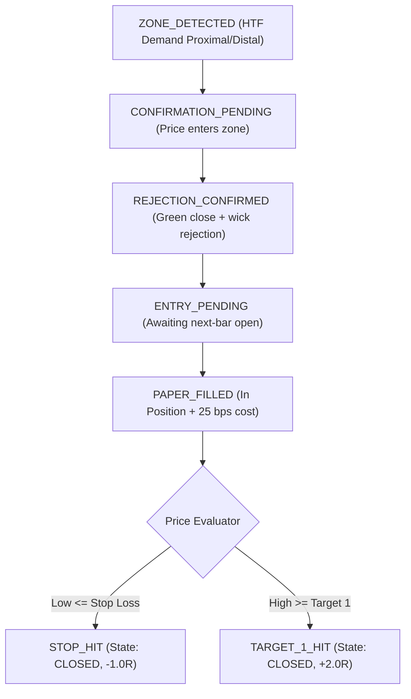

# 🔁 PHASE 10.2J — END-TO-END PAPER TRADING REPLAY AUDIT

**Project:** Dhyanaksh — HTF Supply & Demand Quant Terminal  
**Ledger:** [`PAPER_TRADING_V1_1_REPLAY_TEST_EVENTS.csv`](file:///d:/New%20folder/AI%20Quant/PAPER_TRADING_V1_1_REPLAY_TEST_EVENTS.csv)  
**Historical Replay Sample:** **3,643 Events / 563 Closed Trades**

---

## 1. COMPLETE LIFECYCLE RECONSTRUCTION

The isolated replay engine validates natural execution progression across all states:

- **Demand Scope:** 100% Demand-only filtering active.
- **Timing Integrity:** `confirmation_timestamp < entry_timestamp` strictly verified across all 563 completed trades.
- **Prospective Cohort Isolation:** 0 replay events entered `PAPER_TRADING_V1_1_DEMANDCONF_EVENTS.csv`.
