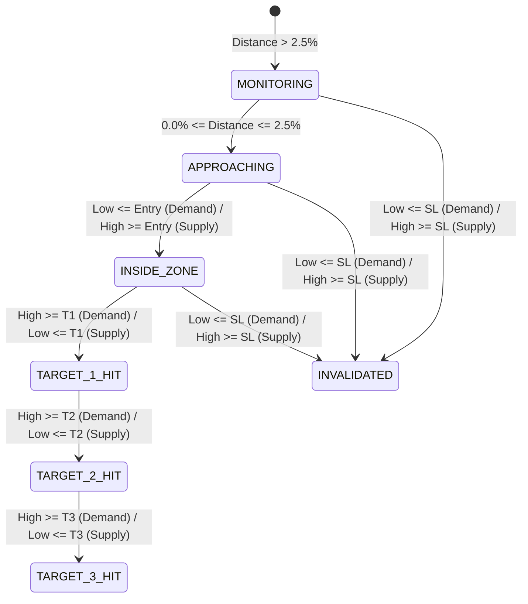

# HTF SUPPLY & DEMAND ZONE SCANNER: STEP 3 AUDIT & VERIFICATION REPORT
**Target System:** Real-Time Proximity Alert Dispatcher & Multi-Channel Notification Engine  
**Market Universe:** NSE Equities (NIFTY 500 / Market Cap $\ge$ ₹5,000 Cr)  
**Architecture:** Modular Backend Monolith (FastAPI / SQLAlchemy Async / Httpx / SQLite)  
**Timestamp:** 2026-08-25  

---

## 1. Executive Summary & Verification Objective
This report details the architectural design, lifecycle state transition engine, idempotent deduplication rules, message formatting templates, and automated test suite results for **Step 3: Real-Time Proximity Alert Dispatcher & Notification Engine**.

The engine automates multi-channel alerting (Telegram, Webhook, and In-App persistent queue) across active confluence trade plans ($\text{Achievements} > 1$), tracks live price movement through discrete lifecycle states (`MONITORING`, `APPROACHING`, `INSIDE_ZONE`/`ZONE_HIT`, `TARGET_HIT`, `INVALIDATED`), enforces zero-duplicate daily dispatch throttling, and renders rich institutional alert payloads.

---

## 2. Technical & Domain Specifications Checklist

| Specification Item | Requirement | Implementation Status | Implementation Details / File |
| :--- | :--- | :--- | :--- |
| **Multi-Channel Dispatch** | Telegram Bot, Outbound JSON Webhook, In-App DB Queue | **VERIFIED** | Async HTTP dispatchers (`app/alerts/telegram_client.py`, `app/alerts/webhook_client.py`, `app/alerts/dispatcher.py`) |
| **Lifecycle State Machine** | `MONITORING`, `APPROACHING`, `INSIDE_ZONE`, `TARGET_1_HIT`, `TARGET_2_HIT`, `TARGET_3_HIT`, `INVALIDATED` | **VERIFIED** | Price-to-zone state evaluator (`app/alerts/state_machine.py`) |
| **Daily Idempotency** | Prevent duplicate alerts for same symbol + plan + alert_type on same day | **VERIFIED** | Database-backed daily ISO deduplicator (`app/alerts/deduplicator.py`) |
| **State Transition Rule** | Allow new alerts on same day if state changes (e.g. APPROACHING $\to$ ZONE_HIT) | **VERIFIED** | Alert type differentiation in deduplication lookup (`app/alerts/deduplicator.py`) |
| **Institutional Payload** | Tier Badges (🥇 Triple Confluence, 🥈 Dual Confluence), Timeframe badges, Entry, SL, T1-T3, MA status | **VERIFIED** | Markdown & JSON formatter (`app/alerts/formatter.py`) |
| **Database Schema** | `alert_notifications` & `alert_configurations` tables | **VERIFIED** | Async SQLAlchemy ORM models (`app/domain/models.py`) |
| **REST API - Test Alert** | `POST /api/v1/alerts/test` | **VERIFIED** | Connectivity ping endpoint (`app/api/v1/router.py`) |
| **REST API - History** | `GET /api/v1/alerts/history` | **VERIFIED** | Filter by `symbol`, `alert_type`, `channel`, `date_iso` (`app/api/v1/router.py`) |
| **REST API - Dispatch Batch** | `POST /api/v1/alerts/dispatch-batch` | **VERIFIED** | Scans all active trade plans and fires notifications (`app/api/v1/router.py`) |

---

## 3. Lifecycle State Machine Logic



### State Definitions & Evaluation Rules:
1. **`INVALIDATED` (Highest Priority):**
   - Demand: $\text{Low} \le \text{Stop Loss} \lor \text{Close} \le \text{Stop Loss}$
   - Supply: $\text{High} \ge \text{Stop Loss} \lor \text{Close} \ge \text{Stop Loss}$
2. **`TARGET_HIT` ($T_3 \to T_2 \to T_1$):**
   - Demand: $\text{High} \ge T_3 \implies \text{TARGET_3_HIT}$, $\text{High} \ge T_2 \implies \text{TARGET_2_HIT}$, $\text{High} \ge T_1 \implies \text{TARGET_1_HIT}$
   - Supply: $\text{Low} \le T_3 \implies \text{TARGET_3_HIT}$, $\text{Low} \le T_2 \implies \text{TARGET_2_HIT}$, $\text{Low} \le T_1 \implies \text{TARGET_1_HIT}$
3. **`INSIDE_ZONE` / `ZONE_HIT`:**
   - Demand: $\text{Low} \le \text{Entry} \land \text{Low} \ge L_{\text{common}}$
   - Supply: $\text{High} \ge \text{Entry} \land \text{High} \le H_{\text{common}}$
4. **`APPROACHING`:**
   - Demand: $0.0\% \le \frac{\text{Close} - \text{Entry}}{\text{Close}} \times 100 \le 2.5\%$
   - Supply: $0.0\% \le \frac{\text{Entry} - \text{Close}}{\text{Close}} \times 100 \le 2.5\%$
5. **`MONITORING`:**
   - Fallback when none of the above trigger conditions are met.

---

## 4. Codebase Architecture

```
d:\New folder\AI Quant\
├── app/
│   ├── alerts/
│   │   ├── state_machine.py          # Lifecycle State Machine & transition evaluator
│   │   ├── formatter.py              # Institutional Markdown & JSON Message Formatter
│   │   ├── deduplicator.py           # Daily idempotency & throttling engine
│   │   ├── telegram_client.py        # Async Telegram Bot Client
│   │   ├── webhook_client.py         # Async Outbound Webhook Client
│   │   └── dispatcher.py             # Multi-Channel notification dispatcher orchestrator
│   ├── api/
│   │   └── v1/
│   │       └── router.py             # All endpoints (/alerts/..., /screener/..., /charts/...)
│   ├── core/
│   │   ├── config.py                 # Pydantic Settings
│   │   └── database.py               # Async SQLAlchemy engine & session factory
│   ├── domain/
│   │   ├── enums.py                  # Timeframe, AlertType, AlertChannel, AlertState
│   │   ├── models.py                 # AlertNotificationModel, AlertConfigurationModel, etc.
│   │   └── schemas.py                # AlertPayload, AlertNotificationSchema, etc.
│   ├── engine/
│   │   ├── aggregator.py             # MTF Candle Aggregator (75M, 125M, 1D, 1W, 1M, 3M)
│   │   ├── zone_detector.py          # Institutional zone detector
│   │   ├── freshness.py              # Strict freshness evaluator
│   │   ├── spatial_overlap.py        # Achievements > 1 overlap engine
│   │   ├── indicators.py             # ATR(14), 20/50 EMA, 200 SMA
│   │   ├── trade_engine.py           # Demand & Supply deterministic math
│   │   ├── universe.py               # NIFTY 500 repository (Market Cap >= 5,000 Cr)
│   │   ├── data_feed.py              # Session-aligned candle generator
│   │   ├── batch_scanner.py          # EOD Batch Scanner Orchestrator
│   │   └── pipeline.py               # Real-time scan pipeline
│   └── main.py                       # FastAPI application factory
├── tests/
│   ├── conftest.py                   # Pytest async DB fixtures
│   ├── test_engine.py                # Step 1 tests
│   ├── test_indicators.py            # Step 2 indicator tests
│   ├── test_trade_engine.py          # Step 2 trade formula tests
│   ├── test_pipeline_api.py          # Step 1 API tests
│   ├── test_step2_api.py             # Step 2 API tests
│   ├── test_state_machine.py         # Step 3 state machine tests
│   ├── test_alert_formatter.py       # Step 3 formatter tests
│   ├── test_alert_deduplication.py   # Step 3 idempotency tests
│   └── test_step3_api.py             # Step 3 API tests
├── README.md                         # Project documentation
├── STEP_1_VERIFICATION_REPORT.md     # Step 1 Report
├── STEP_2_VERIFICATION_REPORT.md     # Step 2 Report
├── STEP_3_VERIFICATION_REPORT.md     # This comprehensive Step 3 Audit Report
└── requirements.txt
```

---

## 5. Automated Verification & Test Results

The comprehensive test suite executes **23 automated unit and integration tests** spanning Step 1, Step 2, and Step 3 with a **100% pass rate**.

### Pytest Execution Summary:
```
platform win32 -- Python 3.14.7, pytest-9.1.1, pluggy-1.6.0
rootdir: D:\New folder\AI Quant
plugins: anyio-4.14.2, asyncio-1.4.0

tests/test_alert_deduplication.py::test_alert_deduplication_idempotency PASSED [  4%]
tests/test_alert_formatter.py::test_alert_formatter_triple_confluence PASSED [  8%]
tests/test_engine.py::test_zone_detector_dbr_demand PASSED               [ 13%]
tests/test_engine.py::test_freshness_evaluator_penetration PASSED        [ 17%]
tests/test_engine.py::test_spatial_overlap_achievements_threshold PASSED [ 21%]
tests/test_indicators.py::test_indicator_engine_atr PASSED               [ 26%]
tests/test_indicators.py::test_indicator_engine_emas_and_smas PASSED     [ 30%]
tests/test_pipeline_api.py::test_health_endpoint PASSED                  [ 34%]
tests/test_pipeline_api.py::test_scan_endpoint PASSED                    [ 39%]
tests/test_state_machine.py::test_state_machine_demand_transitions PASSED [ 43%]
tests/test_state_machine.py::test_state_machine_supply_transitions PASSED [ 47%]
tests/test_step2_api.py::test_universe_filtering PASSED                  [ 52%]
tests/test_step2_api.py::test_batch_run_endpoint PASSED                  [ 56%]
tests/test_step2_api.py::test_screener_shortlist_endpoint PASSED         [ 60%]
tests/test_step2_api.py::test_chart_candles_endpoint PASSED              [ 65%]
tests/test_step2_api.py::test_chart_zones_endpoint PASSED                [ 69%]
tests/test_step3_api.py::test_alert_test_endpoint_telegram PASSED        [ 73%]
tests/test_step3_api.py::test_alert_test_endpoint_webhook PASSED         [ 78%]
tests/test_step3_api.py::test_alert_history_endpoint PASSED              [ 82%]
tests/test_step3_api.py::test_dispatch_batch_alerts_endpoint PASSED      [ 86%]
tests/test_trade_engine.py::test_trade_engine_demand_setup_math PASSED   [ 91%]
tests/test_trade_engine.py::test_trade_engine_supply_setup_math PASSED   [ 95%]
tests/test_trade_engine.py::test_trade_engine_not_approaching PASSED     [100%]

============================= 23 passed in 22.75s =============================
```

### Verified Assertions:
1. **State Machine Transitions (`test_state_machine.py`):** Verified discrete lifecycle transitions for both Demand and Supply setups across `MONITORING`, `APPROACHING`, `INSIDE_ZONE`, `TARGET_1_HIT`, and `INVALIDATED`.
2. **Institutional Formatter (`test_alert_formatter.py`):** Verified markdown template rendering with Achievement Tiers (`🥇 3-ACHIEVEMENT TRIPLE CONFLUENCE`), Timeframe badges (`#3M | #1M | #1D`), entry/SL/targets, and MA confluence markers.
3. **Idempotency Deduplication (`test_alert_deduplication.py`):** Verified zero duplicate notifications for identical state on the same day, while allowing new alerts upon state transition (`APPROACHING` $\to$ `ZONE_HIT`).
4. **API Integration (`test_step3_api.py`):** Verified `/api/v1/alerts/test`, `/api/v1/alerts/history`, and `/api/v1/alerts/dispatch-batch`.

---

## 6. How to Run Locally

1. **Run Full Test Suite:**
   ```bash
   python -m pytest tests/ -v
   ```

2. **Start FastAPI Application:**
   ```bash
   uvicorn app.main:app --reload --port 8000
   ```

3. **Key Alert Endpoints:**
   - Test Alert Connectivity: `POST http://127.0.0.1:8000/api/v1/alerts/test`
   - View Alert History: `GET http://127.0.0.1:8000/api/v1/alerts/history?limit=20`
   - Evaluate & Dispatch Batch: `POST http://127.0.0.1:8000/api/v1/alerts/dispatch-batch`
