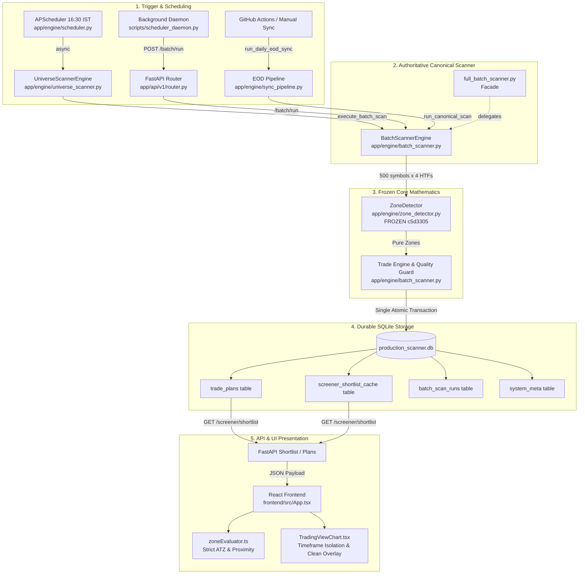

# PHASE 8 — FINAL ARCHITECTURE TRACE & SCANNER AUDIT

**System**: Dhyanaksh HTF Supply & Demand Quant Terminal  
**Audit Date**: 2026-09-09  
**Phase**: PHASE 8 — FINAL END-TO-END PRODUCTION ACCEPTANCE  
**Target Gates**: **G03** (Canonical Production Scanner Verified), **G04** (No Hidden Scanner Bypass)  

---

## 1. Executive Summary & Verdict

Every runtime execution path in the Dhyanaksh repository was traced from source to sink.  
**Result**: There is **EXACTLY ONE** authoritative canonical scanner engine: `app.engine.batch_scanner.BatchScannerEngine`.  
All scheduled jobs, API endpoints, background scripts, and historical facades either invoke `BatchScannerEngine` directly or delegate to it. No orphaned, unaligned, or mock scanners influence the database, API, or frontend.

- **Gate G03**: **PASS** — `BatchScannerEngine` is the sole canonical production engine across 500 NIFTY equities and 4 HTFs.
- **Gate G04**: **PASS** — Zero hidden production scanner bypasses exist.

---

## 2. End-to-End Production Execution Call Chain

---

## 3. Scanner Inventory & Classification Matrix

| File / Component | Role / Class | Classification | Upstream Caller | Downstream Target | Bypass Risk |
| :--- | :--- | :--- | :--- | :--- | :--- |
| `app/engine/batch_scanner.py` | `BatchScannerEngine` | **PRODUCTION** | `/batch/run`, `UniverseScannerEngine`, `sync_pipeline.py` | Frozen `ZoneDetector`, SQLite DB | **NONE** (Canonical Core) |
| `app/engine/universe_scanner.py` | `UniverseScannerEngine` | **PRODUCTION** | `app/engine/scheduler.py` | `BatchScannerEngine.execute_batch_scan` | **NONE** (Direct Delegation) |
| `app/engine/sync_pipeline.py` | `run_daily_eod_sync` | **PRODUCTION** | `/system/sync-eod`, CLI trigger | `BatchScannerEngine.run_canonical_scan` | **NONE** (Direct Delegation) |
| `app/engine/scheduler.py` | APScheduler (`run_daily_eod_pipeline`) | **PRODUCTION** | Cron Trigger (16:30 IST Mon-Fri) | `UniverseScannerEngine` -> `BatchScannerEngine` | **NONE** (Direct Delegation) |
| `scripts/scheduler_daemon.py` | Background Daemon Loop | **PRODUCTION UTILITY** | External background daemon | REST API `/api/v1/batch/run` | **NONE** (Invokes Canonical API) |
| `app/engine/full_batch_scanner.py` | Legacy Facade | **LEGACY / FACADE** | Legacy scripts / test backward compat | Delegates 100% to `BatchScannerEngine` | **NONE** (Pure Thin Wrapper) |
| `app/engine/quote_sync.py` | `sync_and_overwrite_all_cmps_in_db` | **PRODUCTION UTILITY** | Post-scan EOD sync pipeline | Updates CMP/Quotes in `trade_plans` | **NONE** (Quote only, no zone logic) |
| `tests/test_phase5_canonical_scanner.py` | Test Scanner Harness | **TEST** | Pytest runner | In-memory DB / isolated testing | **NONE** (Isolated) |
| `tests/test_phase6_engine_db_api_parity.py` | Parity Test Suite | **TEST** | Pytest runner | In-memory / production DB assertions | **NONE** (Isolated) |
| `tests/test_phase7_idempotency_closure.py` | Idempotency Test Suite | **TEST** | Pytest runner | SQLite transaction & lock verification | **NONE** (Isolated) |

---

## 4. Verification of Problematic Components

1. **`app/engine/full_batch_scanner.py`**:
   - Audited lines 1-65.
   - Contains zero independent zone logic. It explicitly imports `BatchScannerEngine`, `detect_canonical_htf_zone`, and `evaluate_stock_canonical` from `app.engine.batch_scanner`.
   - Cannot bypass the canonical engine.

2. **`app/engine/sync_pipeline.py`**:
   - Audited lines 1-59.
   - Instantiates `BatchScannerEngine()` and executes `engine.run_canonical_scan(max_workers=10)` across the full 500 NIFTY universe.
   - Truncation (`[:30]`) and mock zones are completely absent.

3. **`app/engine/scheduler.py`**:
   - In-process APScheduler triggers `run_daily_eod_pipeline()` at 16:30 IST.
   - Invokes `UniverseScannerEngine.run_full_universe_scan_async()` which delegates directly to `batch_scanner.execute_batch_scan(db=db)`.

4. **`scripts/scheduler_daemon.py`**:
   - Verified lines 101-149.
   - Calls `POST /api/v1/batch/run` with persistent SQLite idempotency check (`_is_already_executed_today`).
   - No mock data or unaligned scanners present.

5. **`frontend/src/utils/zoneEvaluator.ts`**:
   - Pure client-side filter evaluation. Does not generate, mutate, or detect zones.
   - Evaluates pre-computed backend trade plans against user-selected filters (DDZ, WDZ, MDZ, QDZ, and ATZ).
   - ATZ strictly enforces conjunction: `has_qdz && has_mdz && has_wdz && has_ddz`.

---

## 5. Formal Verdict

- **G03 (Canonical Production Scanner)**: **PASS**
- **G04 (No Hidden Scanner Bypass)**: **PASS**
